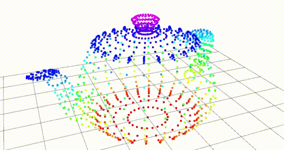

# ROS2 Point Cloud 




This is an example ROS2 (python) package which demonstrates how to utilize the `sensor_msg.msg.PointCloud2`. The various scripts show how to publish a point cloud represented by a `numpy` array as a `PointCloud2` message, and vice versa. I also demonstrate how to visualize a point cloud in RViz2.

**Note:** This was initially posted on [SebastianGrans.github.io](http://sebastiangrans.github.io), but this is the more recent version.

## Installation

Move to your ROS workspace source folder, e.g:
```
cd ~/dev_ws/src
```
Clone this repo:
```
git clone https://github.com/SebastianGrans/ROS2-Point-Cloud-Demo.git
```
Compile:
```
colcon build --symlink-install --packages-select pcd_demo
```


## Running
Source the installation:
```
cd ~/dev_ws/
source install/local_setup.sh # If you use bash
# _or_
source install/local_setup.zsh # If you use zsh
```


### Publisher demo
#### Using a launch file (automatically starts RViz)
```
ros2 launch pcd_demo pcd_publisher_demo.launch.py
```
RViz should now show a spinning Utah teapot! 

#### Manually

```
ros2 run pcd_demo pcd_publisher_node ~/dev_ws/src/pcd_publisher/resource/teapot.ply    
```
In a new terminal:
```
ros2 run rviz2 rviz2
```
Make sure the `Displays` panel is visible `Panels > [✔] Displays`. Then, in the lower corner, press `Add` and select `PointCloud2`. In the list, expand `PointCloud2` and specify `pcd` as the topic. 

RViz should now show a spinning Utah teapot! 

### Subscriber demo
This demo is similar to the one above, but rather than relying on RViz, we instead use [Open3D](http://www.open3d.org/) for visualization. 

#### Running from launch file

```
ros2 launch pcd_demo pcd_pubsub_demo.launch.py
```

#### Manually

In one terminal, run the publisher:
```
ros2 run pcd_demo pcd_publisher_node ~/dev_ws/src/pcd_publisher/resource/teapot.ply    
```
and in another terminal, run the subscriber node:
```
ros2 run pcd_demo pcd_subscriber_node
```

